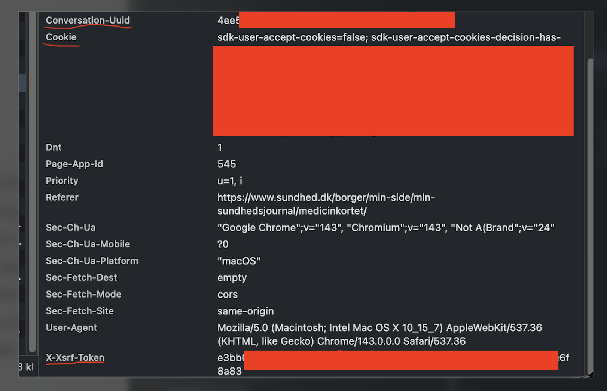

# dhroxy - Danish Healthcare Infrastructure Proxy

This service exposes a read-only FHIR API that maps sundhed.dk endpoints into FHIR resources. The server runs at `/fhir`.

## Supported resources and source endpoints
- Patient → personvælger (/app/personvaelgerportal/api/v1/GetPersonSelection)
- Observation (labs) → labsvar (/api/labsvar/svaroversigt)
  - `category` mapped to sundhed.dk `omraade` (default `Alle`): `laboratory|kliniskbiokemi`→KliniskBiokemi, `mikro*`→Mikrobiologi, `patologi`→Patologi, other/blank→Alle.
- Condition (diagnoser) → e-journal forløbsoversigt (/app/ejournalportalborger/api/ejournal/forloebsoversigt)
- Encounter (kontaktperioder) → e-journal kontaktperioder (/app/ejournalportalborger/api/ejournal/kontaktperioder?noegle=…)
- DocumentReference (epikriser/notater) → e-journal epikriser + notater (/app/ejournalportalborger/api/ejournal/epikriser, /notater)
- MedicationStatement → medicinkort ordination details (/app/medicinkort2borger/api/v1/ordinations/{id}/details)
- MedicationRequest → medicinkort prescriptions (/app/medicinkort2borger/api/v1/prescriptions/overview + details)
- Immunization → vaccination (/app/vaccination/api/v1/effectuatedvaccinations)
- ImagingStudy/DiagnosticReport → billedbeskrivelser (/app/billedbeskrivelserborger/api/v1/billedbeskrivelser/henvisning*/henvisninger)
- Appointment → aftalerborger (/app/aftalerborger/api/v1/aftaler/cpr)
- Organization → minlæge + core organisation (/api/minlaegeorganization + /api/core/organisation/{id})

## Headers and auth
- The proxy is stateless. It forwards incoming headers (case-insensitive) that are listed in `application.yml` under `sundhed.client.forwarded-headers` and supplements them with `sundhed.client.static-headers`.
- You can also preconfigure static headers in `application.yml` (e.g., `cookie`, `x-xsrf-token`, `conversation-uuid`, `user-agent`). If a static header is set, it overrides the incoming one.
- Typical required headers for sundhed.dk calls (examples in `application.yml`): `cookie`, `x-xsrf-token`, `conversation-uuid`, `user-agent`. These are forwarded to every upstream call.
- If you prefer not to send them per-request, set them in `application.yml`; the proxy will still accept per-request overrides.

## Example: Read/Search-Only FHIR Transaction

Only GET-based entries are allowed in a FHIR transaction. The example below fetches a small slice of each exposed resource type in a single request:

```json
{
  "resourceType": "Bundle",
  "type": "transaction",
  "entry": [
    {
      "request": {
        "method": "GET",
        "url": "Patient"
      }
    },
    {
      "request": {
        "method": "GET",
        "url": "Observation?date=ge2024-01-01"
      }
    },
    {
      "request": {
        "method": "GET",
        "url": "Condition"
      }
    },
    {
      "request": {
        "method": "GET",
        "url": "Encounter"
      }
    },
    {
      "request": {
        "method": "GET",
        "url": "DocumentReference"
      }
    },
    {
      "request": {
        "method": "GET",
        "url": "MedicationStatement"
      }
    },
    {
      "request": {
        "method": "GET",
        "url": "MedicationRequest"
      }
    },
    {
      "request": {
        "method": "GET",
        "url": "ImagingStudy"
      }
    },
    {
      "request": {
        "method": "GET",
        "url": "DiagnosticReport"
      }
    },
    {
      "request": {
        "method": "GET",
        "url": "Immunization"
      }
    },
    {
      "request": {
        "method": "GET",
        "url": "Organization"
      }
    }
  ]
}
```

POST this bundle to `/fhir` and the proxy will return a `transaction-response` bundle where each entry contains the matching response bundle or resource for that GET. Only GET operations (read/search) are accepted inside a transaction; any other HTTP verb will be rejected.
  
## Running with Docker (distroless runtime)

Build and run:
```bash
docker build -t dhroxy .
docker run -p 8080:8080 \
  -e SUNDHED_STATIC_COOKIE='sdk-user-accept-cookies=false; ...' \
  -e SUNDHED_STATIC_X_XSRF_TOKEN='your-xsrf' \
  -e SUNDHED_STATIC_CONVERSATION_UUID='f8da2975-6c6e-...' \
  -e SUNDHED_STATIC_USER_AGENT='Mozilla/5.0 (Macintosh; Intel Mac OS X 10_15_7) AppleWebKit/537.36 (KHTML, like Gecko) Chrome/143.0.0.0 Safari/537.36' \
  dhroxy
```

### Static headers via env vars
Static headers in `application.yml` under `sundhed.client.static-headers` can be overridden with env vars using upper-case keys prefixed with `SUNDHED_STATIC_`, dots/hyphens replaced by underscores. Examples:
- `sundhed.client.static-headers.cookie` → `SUNDHED_STATIC_COOKIE`
- `sundhed.client.static-headers.x-xsrf-token` → `SUNDHED_STATIC_X_XSRF_TOKEN`
- `sundhed.client.static-headers.conversation-uuid` → `SUNDHED_STATIC_CONVERSATION_UUID`
- `sundhed.client.static-headers.user-agent` → `SUNDHED_STATIC_USER_AGENT`

If provided, these override incoming request headers; if omitted, per-request headers are forwarded according to `sundhed.client.forwarded-headers`.

### Where to copy headers from
In the sundhed.dk portal, open the browser dev tools → Network tab, pick any authenticated API call, and copy the cookies/XSRF/conversation UUID and user-agent from the request headers. The screenshot below highlights the relevant headers:



## MCP (Model Context Protocol) tools

The service exposes a minimal MCP toolset (enabled when `spring.ai.mcp.server.enabled=true`):

- `read-fhir-resource`: GET any FHIR resource by `resourceType` and `id`.
- `search-fhir-resources`: GET search on a resource type, with `query` parameters.
- `create-fhir-transaction`: POST a Bundle of type `transaction` (read/search-only enforced).

Transport: HTTP Servlet endpoint from Spring AI MCP starter (`/mcp` by default). JSON mapper is Jackson (MCP SDK 0.13.1). The MCP bridge dispatches requests into the embedded HAPI server and returns the FHIR JSON payload and HTTP status inside MCP `CallToolResult`.
